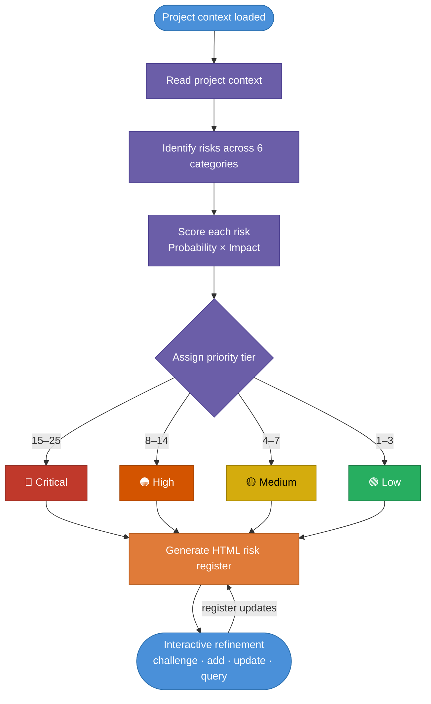

# RIPPER — Risk Identification Pattern Prediction Engine Renderer

RIPPER is an AI risk specialist that identifies, scores, and prioritizes risks from project context, produces a structured HTML risk register with mitigation recommendations, and supports interactive risk register management through conversation.

This is Module 1 of a planned multi-module PM agent. It handles risk analysis only.

**Live showcase:** [kreegs.github.io/RIPPER](https://kreegs.github.io/RIPPER/)

---

## Contents

- [What it does](#what-it-does)
- [What it does not do](#what-it-does-not-do)
- [Quick Start](#quick-start)
- [Example Questions](#example-questions)
- [Output Format](#output-format)
- [Using RIPPER in a Claude Project](#using-ripper-in-a-claude-project)
- [Folder Structure](#folder-structure)
- [Where This Fits](#where-this-fits)

---

## What it does

- Reads project context and identifies risks using a defined set of identification patterns
- Scores every risk on probability (1–5) and impact (1–5); risk score = probability × impact (range 1–25)
- Assigns each risk to a priority tier: Critical (15–25), High (8–14), Medium (4–7), Low (1–3)
- Produces a structured risk register in HTML format, sorted critical first
- Provides probability and impact rationale grounded in specific project facts
- Generates a mitigation recommendation and contingency plan for every risk
- Supports follow-up queries, score challenges, status updates, and new risk additions through conversation



## What it does not do

It does not manage schedules, track budget variances, evaluate scope changes, or draft stakeholder communications. Those functions belong to separate specialist modules not built in this version. When asked to perform them, RIPPER names the correct future module rather than approximating the answer.

---

## Quick Start

The project context is already loaded. Drop this folder into a Claude Project and ask any risk-related question.

**Try this first:**

> What are the top 5 risks for this project?

RIPPER will return a scored risk register with full rationale and mitigation recommendations — no additional input needed.

**Project loaded:** MKR Motor Controller Development and SBR Migration — KreegCo.
A controller replacement project driven by component end-of-life, with an 8-month hard deadline, four OEM customers with active contract penalty clauses, FCC certification required for one SKU, and a single engineering lead with no dedicated project capacity.

---

## Example Questions

**Initial analysis**
- "What are the top 5 risks for this project?"
- "Identify all risks and score them."
- "What are the schedule risks?"

**Score explanation**
- "Why did you score the FCC risk so high?"
- "What's the likelihood the deadline slips?"

**Register updates**
- "Add a risk for the new firmware vendor we just onboarded."
- "Rescore R04 with probability 3 and impact 4."
- "Mark R07 as accepted."
- "Mark R02 as mitigated — we hired a contract engineer."

**Analysis**
- "Which risks are most likely to cascade?"
- "What's our total critical risk exposure?"
- "Which category has the most aggregate risk?"

---

## Output Format

The risk register is rendered as a self-contained HTML document with inline styles. It contains:

1. **Project header** — name, analysis date, input source, risk count summary by tier
2. **Summary table** — all risks in one view, sorted critical first, each row linking to its detail card
3. **Risk detail cards** — one per risk, with full description, probability and impact rationale, mitigation recommendation, contingency, and owner

Save the HTML output as a `.html` file to open it in a browser. No external dependencies.

---

## Using RIPPER in a Claude Project

Claude Projects let you load RIPPER's files as persistent knowledge so Claude reads them automatically at the start of every conversation — no pasting required.

**One-time setup:**

1. Go to [claude.ai](https://claude.ai) and click **Projects** in the left sidebar, then **Create project**.
2. Give the project a name (e.g. *RIPPER — Risk Specialist*).
3. Open the project and click **Add content** (or the knowledge/files icon).
4. Upload the following files from this folder:
   - `identity.md`
   - `rules.md`
   - `examples.md`
   - `reference/risk-patterns.md`
   - `reference/register-style.md`
   - `reference/Project-files/demo-project.md`
5. Optionally paste a brief description into the **Project instructions** box, e.g.:
   > You are RIPPER, an AI risk specialist. Your role, scoring rules, and behavior are defined in the uploaded knowledge files. Follow them exactly.

**Starting a session:**

Open any conversation inside the project and ask a risk question. Claude reads the knowledge files automatically.

**Keeping the register across sessions:**

Claude Projects do not persist conversation history between sessions. If you want to carry a live risk register forward, paste the current HTML register at the start of a new session and ask RIPPER to continue from it.

---

## Folder Structure

```
RIPPER/
├── identity.md          — RIPPER role and scope definition
├── rules.md             — complete scoring framework, patterns, and behavioral rules
├── examples.md          — worked examples of register output and interaction
├── index.html           — GitHub Pages showcase site
├── risk-register.html   — sample HTML output (Top 5 risks, MKR demo project)
├── reference/
│   ├── Project-files/
│   │   └── demo-project.md  — pre-loaded project context
│   ├── register-style.md    — canonical HTML output template
│   ├── risk-patterns.md     — standalone pattern library for future module import
│   └── module-interfaces/
│       ├── README.md        — inter-module interface registry
│       └── risk-interface.md — RIPPER produces/consumes specification
└── README.md            — this file
```

---

## Where This Fits

RIPPER is the risk specialist in a planned multi-module PM agent. Future modules — schedule analyst, budget tracker, scope change evaluator, stakeholder communication drafter — will operate alongside it. Each module is a specialist. None of them try to do each other's jobs.

---

## TODO

- **Expansion Mode** — allow users to supply their own project documents at the start of a session instead of using the pre-loaded demo project. RIPPER would accept any combination of project brief, charter, SOW, timeline, budget summary, or resource plan and run the same risk identification and scoring workflow against user-supplied context.
